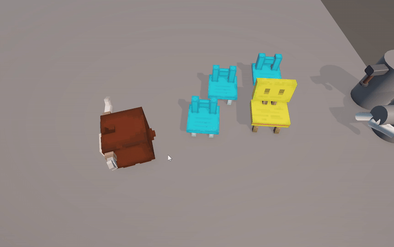
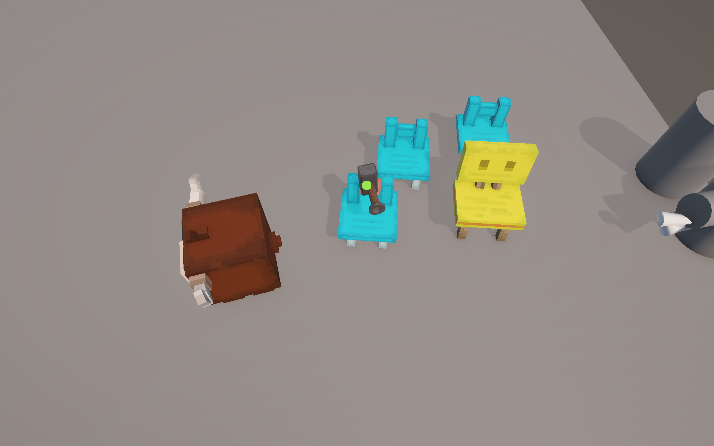
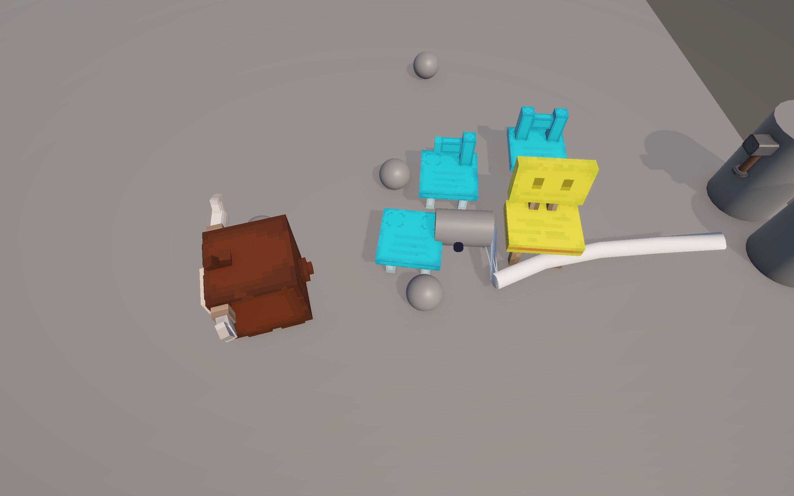
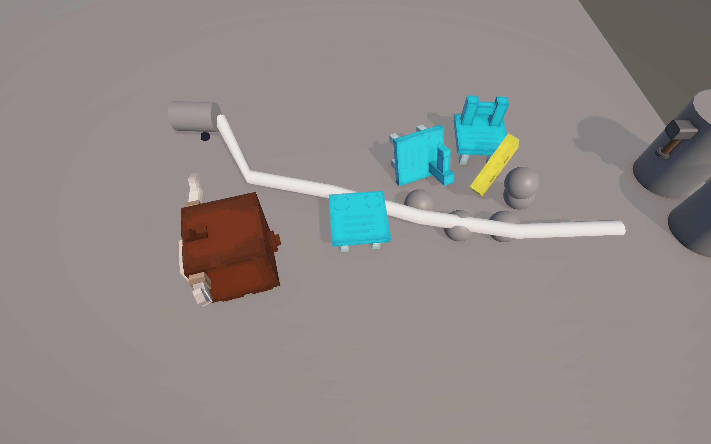
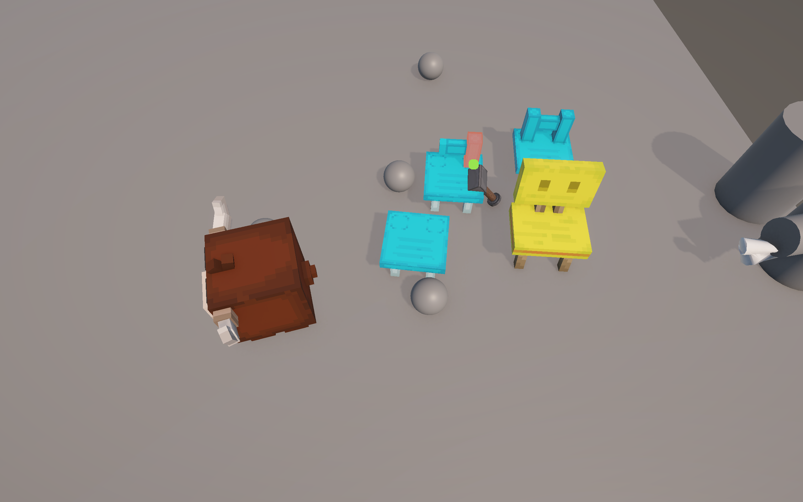
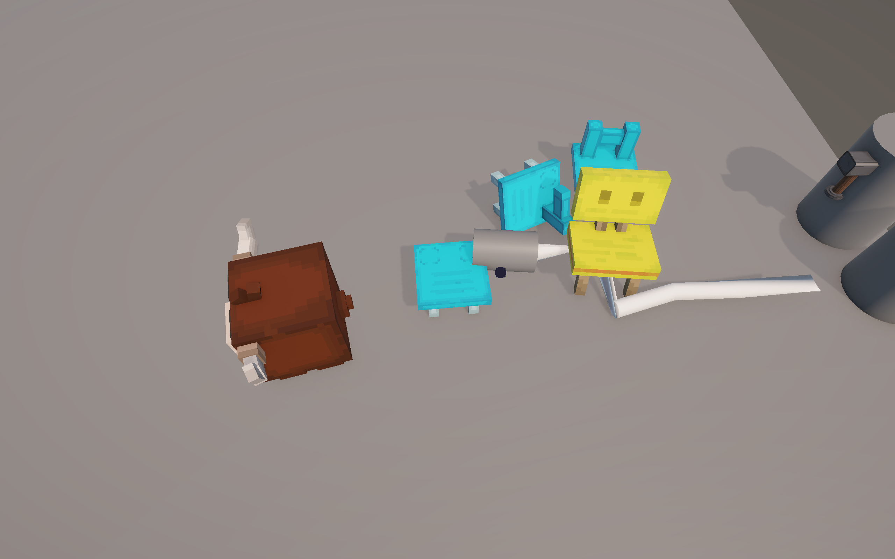
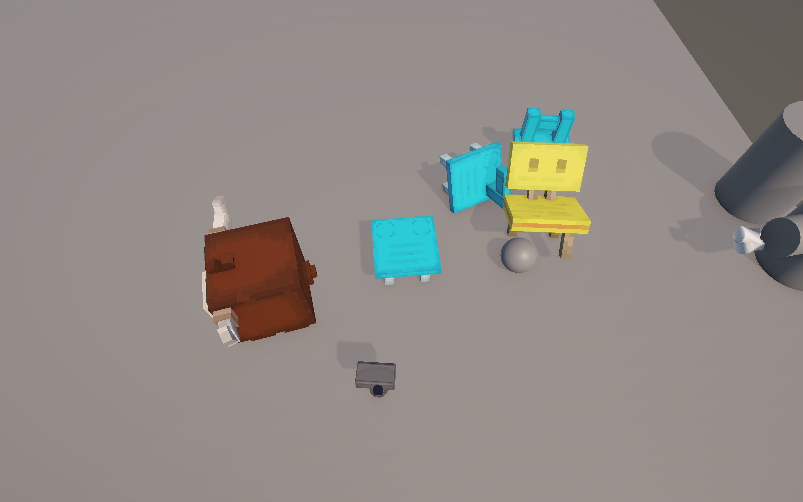
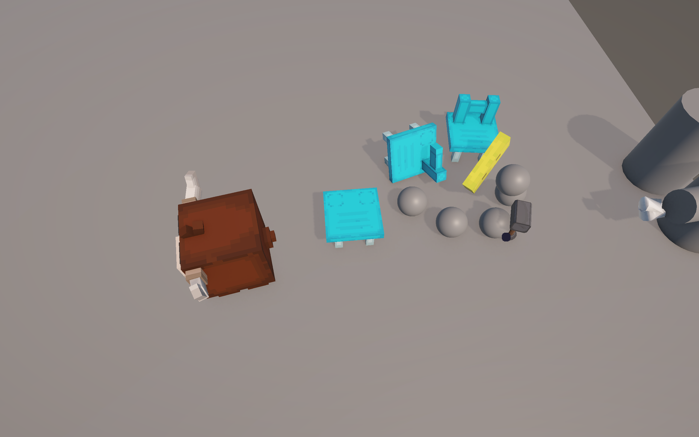

# Physics-Based Incremental Game

An experimental incremental game prototype focused on advanced Unity physics systems. Built to push my understanding of ConfigurableJoints, procedural mesh generation, and physics-based destruction beyond basic tutorials.


*Real-time physics simulation with rope and destruction systems*


*Physics-based destruction and tool interaction system*

## 🎯 Project Goals

This project was all about **mastering Unity's physics systems** and building technical foundations:
- **ConfigurableJoints** for realistic rope simulation
- **Procedural mesh generation** for dynamic rope rendering
- **Improved state machine** for tool management
- **Physics-based destruction** without relying on pre-made assets

## 🔧 What I Built

### 1. Tool State Machine (Improved Architecture)

Built a cleaner, more maintainable tool system compared to my previous projects.

**State Transitions:**
```csharp
// Three-state system for tool management
Current Tool == Picked Tool  → De-equip (null state)
Current Tool == null         → Equip new tool
Current Tool != Picked Tool  → Switch tools
```

**Why This Is Better:**
- Previous project: Tools were managed with messy if-else chains
- This project: Clean state-based logic with event-driven architecture
- Easy to add new tools without touching existing code

**Code:**
```csharp
public void SetTool(Tools nextTool) {
    if (CurrentTool == nextTool) {
        CurrentTool.DeEquippedLogic();
        CurrentTool = null;
    } 
    else if (CurrentTool == null) {
        CurrentTool = nextTool;
        CurrentTool.EquippedLogic();
    } 
    else {
        CurrentTool.DeEquippedLogic();
        CurrentTool = nextTool;
        CurrentTool.EquippedLogic();
    }
}
```


*Improved tool state machine with smooth transitions*

### 2. Physics-Based Rope System (ConfigurableJoints)

My first deep dive into Unity's joint system — built a fully simulated rope using ConfigurableJoints instead of LineRenderer or pre-made rope packages.

**How It Works:**
1. **Segment Generation**: Dynamically create rope segments between two points
2. **ConfigurableJoint Setup**: Each segment connected with properly configured joints
3. **Angular Limits**: X/Y rotation free, Z rotation locked for realistic swinging
4. **Spring/Damper System**: Soft joint limits for natural rope behavior

**Key Technical Details:**
```csharp
ConfigurableJoint Settings:
- Position Motion: Locked (maintains distance)
- Angular X/Y: Free (allows swinging)
- Angular Z: Locked (prevents twisting)
- Spring: 500, Damper: 100 (realistic physics response)
```

**Collision Avoidance:**
```csharp
// Ignore collisions between adjacent segments
Physics.IgnoreCollision(segment[i], segment[i-1], true);
Physics.IgnoreCollision(segment[i], segment[i+1], true);
```


*ConfigurableJoint-based rope with physics simulation*

### 3. Procedural Mesh Generation

Built a custom mesh generator to visualize the rope in real-time — my first serious attempt at runtime mesh generation.

**Pipeline:**
1. **Circle Vertices**: Generate vertices around each segment (configurable sides)
2. **Rotation Alignment**: Align vertex circles with segment forward direction
3. **Triangle Generation**: Connect vertices between segments using index mapping
4. **Dynamic Updates**: Regenerate mesh every frame to follow physics

**Math Behind It:**
```csharp
// Generate circular vertices around segment
float angleInRad = sideIndex * (360 / sides) * Mathf.Deg2Rad;
float x = -radius * Mathf.Cos(angleInRad);
float y = radius * Mathf.Sin(angleInRad);

// Rotate to match segment orientation
Vector3 rotatedPoint = diffRotation * new Vector3(x, y, 0);
Vector3 vertex = segmentTransform.position + rotatedPoint;
```

**Triangle Indexing:**
```csharp
// Connect current segment to next segment
int a = vertexMap[segment, side];
int b = vertexMap[segment+1, side];
int c = vertexMap[segment, side+1];
int d = vertexMap[segment+1, side+1];

AddTriangles(a, d, c);  // First triangle
AddTriangles(d, a, b);  // Second triangle
```


*Procedurally generated rope mesh following physics*

### 4. Physics-Based Destruction

Implemented a basic destruction system using physics rather than pre-baked animations.

**Features:**
- Rigidbody fragments spawn on impact
- Force-based debris scatter
- Destruction particles and effects
- Drop item spawning on break

**Technical Approach:**
```csharp
interface IBreakable {
    void Break(Vector3 hitPoint, Vector3 hitNormal);
}
```

While not as polished as commercial destruction systems, this taught me:
- How to work with mesh splitting
- Fragment rigidbody management
- Force application and impulse physics
- Object pooling for performance


*Physics-based destruction with debris scatter*

### 5. Interaction System

Built a unified interaction controller using interfaces and raycasting.

**Systems:**
- **HammerController**: Physics-based hitting with force application
- **HoverController**: Visual feedback for interactable objects
- **CollectController**: Item collection with trigger detection
- **InteractController**: Generic interaction handler

**Architecture:**
```csharp
IInteractable  → Generic interactions
IBreakable     → Destruction logic  
ICollectable   → Item pickup
```


*Unified interaction system with visual feedback*

## 📸 Visual Progress

### Initial State

*Basic scene setup with tools and objects*

### Tool Activation

*Tool equipped and ready for interaction*

### Object Interaction

*Breaking objects with physics response*

### Rope in Action

*ConfigurableJoint rope with physics simulation*

### Destruction System

*Objects breaking apart with debris*

### Mesh Rendering

*Procedurally generated rope mesh*

### Full System

*All systems working together*

## 💡 What I Learned

### ConfigurableJoints Deep Dive
- **Joint limits and drives** are powerful but need careful tuning
- **Spring/damper values** drastically affect feel (500/100 worked best)
- **Collision detection mode** matters for fast-moving joints (use ContinuousSpeculative)
- **Interpolation** is essential for smooth visual results
- Angular limits vs position limits serve different purposes

### Procedural Mesh Generation
- **Index mapping** is crucial for correct triangle winding
- **UV coordinates** need to be calculated for proper texturing
- **Mesh.RecalculateNormals()** doesn't always give the best results
- **Vertex count** impacts performance significantly
- Generating meshes every frame is expensive — consider LOD

### Physics-Based Destruction
- Real-time mesh splitting is **hard** and performance-intensive
- Pre-fractured meshes are industry standard for a reason
- Force application needs **mass consideration**
- Debris lifetime management prevents memory leaks

### State Machine Improvements
- **Event-driven architecture** beats if-else chains
- **Null state** as a valid tool state simplifies logic
- **Transition callbacks** (EquippedLogic/DeEquippedLogic) keep code modular

## 🛠️ Technical Stack

- **Unity 2021.3+** (URP)
- **C#** for all game systems
- **ConfigurableJoint** for rope physics
- **Procedural Mesh API** for rope visualization
- **Physics System** for destruction and interactions

## 📂 Code Structure

```
Assets/_Scripts/
├── Controllers/
│   ├── ToolControllers.cs       # Improved state machine
│   ├── HammerController.cs      # Physics-based hitting
│   ├── InteractController.cs    # Unified interactions
│   └── CollectController.cs     # Item pickup
├── RopePhysics/
│   ├── Wire.cs                  # ConfigurableJoint rope
│   └── WireMeshData.cs          # Procedural mesh generation
├── Breakables/
│   └── LocalBreakableManager.cs # Destruction system
├── Interfaces/
│   ├── IBreakable.cs
│   ├── ICollectable.cs
│   └── IInteractable.cs
└── Input/
    └── InputManager.cs          # Event-based input
```

## 🎓 Key Takeaways

**What Worked:**
- State machine refactor made tool management much cleaner
- ConfigurableJoints are incredibly powerful when configured properly
- Mesh generation isn't as scary as it seemed initially
- Interface-driven design makes systems very flexible

**What Was Challenging:**
1. **ConfigurableJoint Settings**: Took hours of trial-and-error to get rope feel right
2. **Mesh Triangle Winding**: Got inside-out meshes multiple times before understanding winding order
3. **Performance**: Regenerating mesh every frame for multiple ropes tanked FPS
4. **Physics Stability**: High segment count ropes would jitter or explode

**If I Built This Again:**
- Use **Jobs System** for mesh generation (multi-threading)
- Implement **LOD system** for rope segments based on distance
- Add **mesh pooling** instead of destroying/recreating
- Use **compute shaders** for vertex position updates
- Pre-fracture meshes for destruction instead of runtime splitting

## 🔍 Reflections

This project taught me that **physics systems are deep**. ConfigurableJoints alone have dozens of parameters, and understanding how they interact took serious experimentation.

The rope system in particular was a breakthrough moment — seeing the mesh I generated procedurally follow the physics simulation felt like magic. Even though the performance wasn't great, understanding the full pipeline from joint setup → physics simulation → mesh generation → rendering was incredibly valuable.

**Biggest Learning:** Sometimes "simple" features (like rope) have complex underlying systems. Building them from scratch, even if imperfect, teaches you way more than using pre-made solutions.

## ⚠️ Project Status

This is a **technical prototype/learning exercise**, not a finished game:
- Rope performance needs optimization
- Destruction system is basic
- No progression or game loop
- Placeholder art assets

The goal was learning advanced Unity physics, not shipping a game.

---

**Developer**: Mert Özzencir  
**GitHub**: [MertOzzencir](https://github.com/MertOzzencir)  
**Learning Focus**: ConfigurableJoints, procedural mesh generation, physics-based systems
